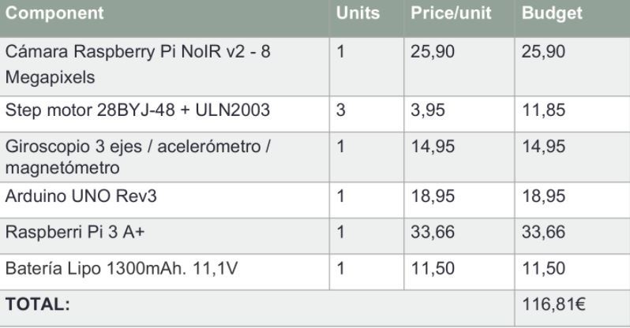
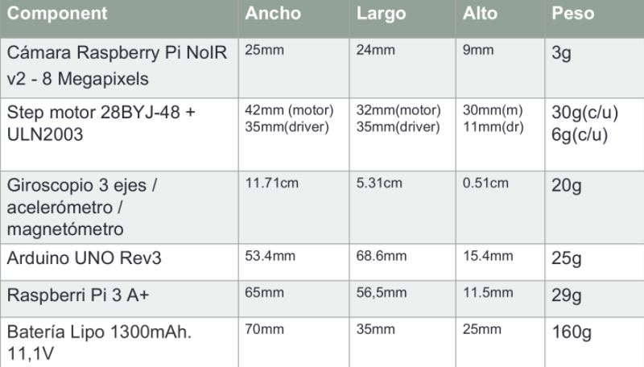
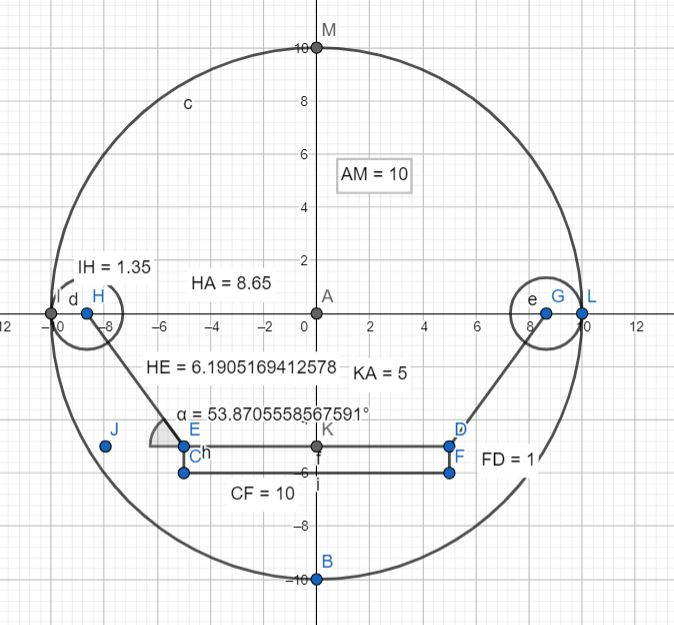
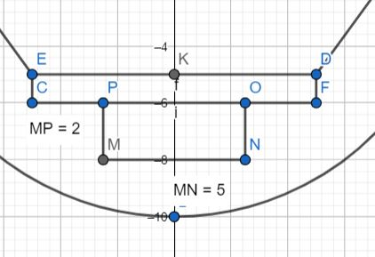
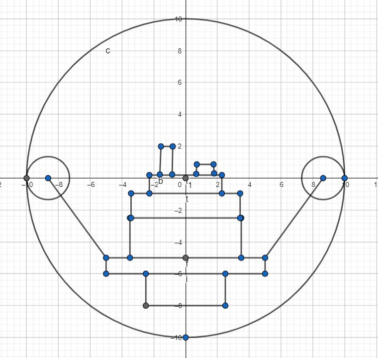

# Diseño del robot

En esta carpeta se incluye el diseño que tendrá el robot.
## Componentes
Los componentes Hardware utilizados serán los siguientes:

El tamaño de cada componente se incluye en la siguiente tabla:

## Esquema 3d
El esquema básico dentro de la bola se compone de una base cilíndrica, sobre la que se colocarán los componentes hardware necesarios, tres ruedas que harán girar la carcasa de la bola mediante la fricción que ejerzan sobre ella, y tres varitas que unan las ruedas a la base. Este esquema se muestra en la siguiente imágen:

las piezas aquí mostradas se obtendrán mediante impresión 3d, y las medidas, colocación y ángulos relevantes de estas se indican en el esquema. 

Debajo de la base se pegará un cilindro que contendrá un peso, que ejercerá como centro de masas para estabilizar el robot internamente. Este cilindro también se obtendrá con impresión 3d.

Finalmente, encima de la base se colocarán los diferentes componentes Hardware de manera estratégica.

